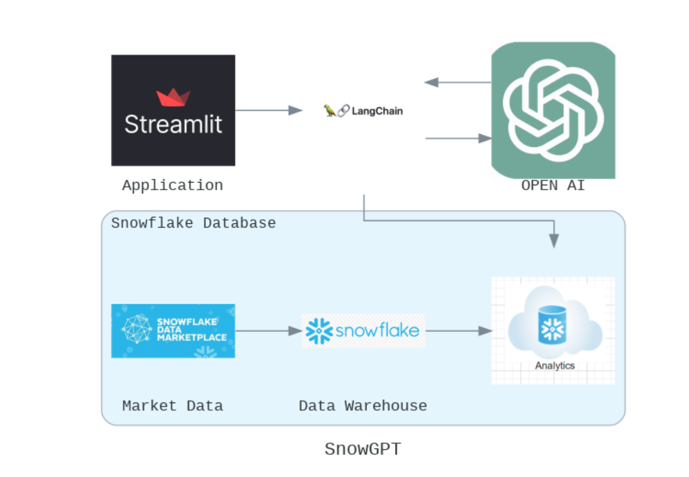

# SnowGPT — Natural Language to SQL on Snowflake

Ask questions about your data warehouse in plain English. SnowGPT converts them into SQL queries using LangChain + OpenAI, executes them against Snowflake, and returns results in a clean Streamlit interface.

    

---

## What it does

- Accepts natural language questions from the user (e.g. *"Which NFL sponsors had the highest app engagement in Q3?"*)
- Converts the question to a syntactically correct SQL query using LangChain's `create_sql_query_chain` with GPT
- Executes the query against Snowflake and displays results as a dataframe
- Provides an editable query field so users can tweak the generated SQL before running
- Includes a built-in analytics dashboard with pre-built charts for quick data exploration

---

## Architecture



---

## Tech Stack

| Layer | Technology |
|---|---|
| Frontend | Streamlit |
| LLM Orchestration | LangChain + OpenAI GPT |
| Data Warehouse | Snowflake |
| UDFs / Stored Procs | Snowpark Python |
| Deployment | Snowflake CLI (`snowcli`) |

---

## Project Structure

```
snowgpt/
├── app/                        # Streamlit application
│   ├── app.py                  # Main app — NL to SQL + UI
│   ├── charts.py               # Analytics dashboard
│   └── requirements.txt
├── database/
│   ├── setup.sql               # Snowflake initial setup
│   ├── nfl_team_lookup.sql     # NFL team-state lookup table
│   ├── orchestrate.sql         # Job orchestration
│   ├── teardown.sql
│   ├── load/                   # Data ingestion scripts
│   │   ├── nfl_sponsor.sql
│   │   ├── consumer_info.sql
│   │   └── app_usage.sql
│   ├── transforms/             # Data transformation into analytics schema
│   │   ├── consumer_data.sql
│   │   ├── app_usage.sql
│   │   └── nfl_sponsor.sql
│   └── udfs/                   # Snowpark Python UDFs + stored procedures
│       ├── consumer_behaviour.py
│       ├── app_user_classification.py
│       └── sponsorship_correlation_sp.py
├── utils/
│   └── snowpark_utils.py
├── docs/
│   └── architecture.png
├── deploy.py                   # Snowpark app deployment script
├── environment.yml
├── requirements.txt
└── .gitignore
```

---

## Getting Started

### Prerequisites

- Python 3.9+
- Snowflake account with a configured warehouse, database, and schema
- OpenAI API key
- `snowcli` installed for UDF/stored procedure deployment

### 1. Clone the repo

```bash
git clone https://github.com/shardulchavan/snowgpt-.git
cd snowgpt-
```

### 2. Set up environment variables

Create a `.env` file in the `app/` directory:

```env
OPENAI_API_KEY=your_openai_api_key
user_login_name=your_snowflake_user
password=your_snowflake_password
account_identifier=your_account_identifier
database_name=your_database
schema_name=your_schema
warehouse_name=your_warehouse
role_name=your_role
```

### 3. Install dependencies

```bash
pip install -r requirements.txt
```

### 4. Set up Snowflake

Run the scripts in order:

```bash
# 1. Initial setup
database/setup.sql

# 2. Load data
database/load/nfl_sponsor.sql
database/load/consumer_info.sql
database/load/app_usage.sql

# 3. Create lookup table
database/nfl_team_lookup.sql

# 4. Deploy UDFs
python deploy.py database/udfs

# 5. Run transforms
database/transforms/consumer_data.sql
database/transforms/app_usage.sql
database/transforms/nfl_sponsor.sql

# 6. Orchestrate
database/orchestrate.sql
```

### 5. Run the app

```bash
cd app
streamlit run app.py
```

---

## Data

The app runs against three datasets loaded into Snowflake:

| Schema | Description |
|---|---|
| `CONSUMER_INFO` | Consumer demographic and interest data |
| `APP_USES` | Mobile app usage by panelists |
| `NFL_SPONSER` | NFL post-game sponsorship exposure data |

Two Snowpark UDFs enrich the data:
- **consumer_behaviour** — identifies sports interests per consumer and concatenates them
- **app_user_classification** — classifies users by generation (e.g. Gen Z, Millennial)

A stored procedure (`sponsorship_correlation_sp`) aggregates NFL and app usage streams into a unified `SPONSORSHIP_APPUSAGES_CORR` table used for analysis.

---

## License
This project is licensed under the [MIT License](LICENSE).
